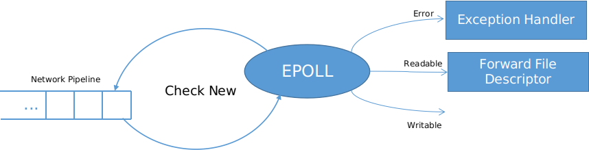

# Listener

A *listener* or a similar component must exist for a server program of any kind to collect data from network pipline. In this project, I set up a listener with some well-known Linux system call interface. The structure of the listening procedure is like this:

An epoll reactor continuously checks whether there is a new incoming packet from network pipeline. If there is a readable packet, forward it to the HTTP handler.

## References

